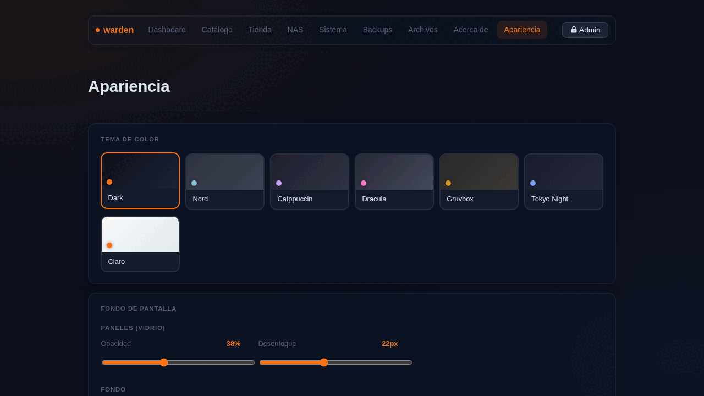

# Apariencia

La sección Apariencia personaliza el aspecto visual del panel. Todo se guarda en `localStorage` del navegador — sin recargar la página y sin guardar nada en el servidor.

## Temas de color

7 temas disponibles que cambian toda la paleta de colores del panel en tiempo real:

| Tema | Acento |
|---|---|
| **Dark** | Naranja — el tema por defecto |
| **Nord** | Azul ártico |
| **Catppuccin Mocha** | Lavanda |
| **Dracula** | Rosa |
| **Gruvbox** | Dorado |
| **Tokyo Night** | Azul índigo |
| **Claro** | Naranja sobre blanco |

El tema persiste en todos los dispositivos que usen el mismo navegador, sin parpadeo al cargar (anti-FOUC).

## Fondos de pantalla

### Desde dharmx/walls

Hacé click en **Cargar fondos** para ver una grilla de imágenes desde el repositorio [dharmx/walls](https://github.com/dharmx/walls). Se cargan 96 imágenes aleatorias vía GitHub API y se cachean 24 horas en tu navegador — sin descargar nada al servidor.

La grilla está paginada (12 por página) para que cargue rápido. Hacé click en cualquier imagen para aplicarla.

### Desde el servidor

En **Imágenes del servidor** podés ingresar una ruta de tu server (por defecto `/srv/warden/wallpapers`) y explorar las imágenes que tengas guardadas ahí. Soporta `.jpg`, `.jpeg`, `.png`, `.webp` y `.gif`.

### Desde tu equipo

El botón **Elegir archivo** abre el selector de archivos de tu equipo. La imagen se redimensiona automáticamente a máximo 1920px de ancho (JPEG 82%) antes de guardarse — para que no ocupe demasiado en el navegador.

### URL personalizada

Pegá la URL directa de cualquier imagen en internet y presioná **Aplicar URL**.

## Contraste automático

Cuando aplicás un fondo de pantalla, warden detecta su luminancia promedio usando canvas. Si la imagen es clara (luminancia > 48%), aplica automáticamente un scrim más oscuro sobre los paneles para que el texto siempre sea legible.

## Ajustes de vidrio

Cuatro sliders para afinar el efecto visual:

### Paneles (vidrio)
- **Opacidad** (5%–90%): qué tan sólidos se ven los cards y paneles. Bajo = más transparente.
- **Desenfoque** (4px–48px): intensidad del efecto frosted glass.

### Fondo
- **Brillo** (20%–160%): oscurecer o aclarar la imagen/gradiente sin tocar el contenido.
- **Desenfoque** (0px–20px): difuminar el fondo para un look más suave.

Todos los ajustes son persistentes y se aplican sin parpadeo al cargar cualquier página.
