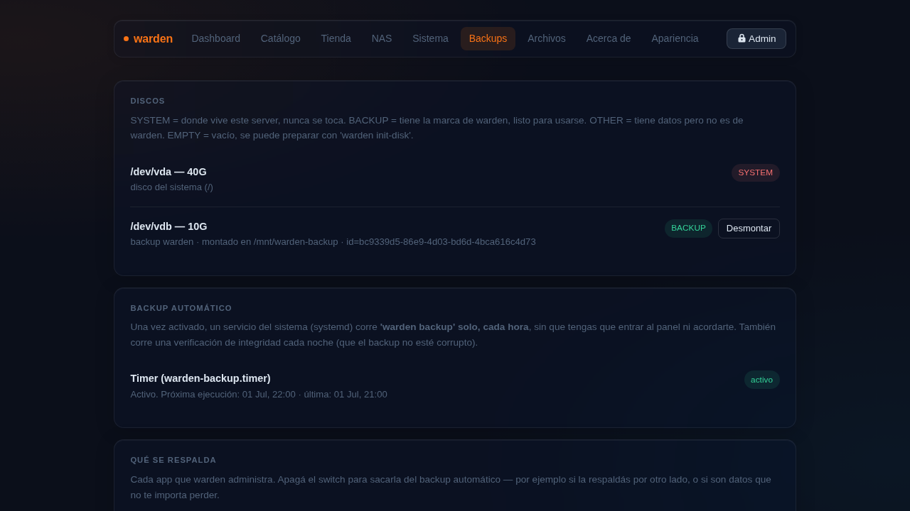

# Backups



warden usa [restic](https://restic.net) corriendo en Docker para backup cifrado, versionado y deduplicado. No hace falta instalarlo en el host.

## Preparar el disco de backup

1. Conectá el disco externo (o usá un disco interno dedicado).
2. En la sección Backups, el panel muestra todos los discos detectados con su rol: `SYSTEM`, `BACKUP`, `OTHER` o `EMPTY`.
3. En un disco vacío → **Preparar disco**: formatea, inicializa el repositorio restic y muestra la **clave de cifrado**.

!!! danger "Guardá la clave de cifrado"
    Es lo único que no se puede recuperar. Guardala en un lugar seguro fuera del server — un gestor de contraseñas, papel, lo que prefieras. Sin ella, los backups son ilegibles.

## Hacer un backup

**Panel** → Backups → **Hacer backup ahora**

El log corre en vivo. El proceso sigue aunque cierres la página.

**CLI:**
```bash
sudo warden backup
```

warden respalda todos los paths y dumps de BD definidos en el catálogo, con tags por componente.

## Snapshots

La lista muestra cada snapshot con:
- Fecha y hora (en tu zona horaria)
- Antigüedad con semáforo de color
- Tamaño del snapshot

## Restaurar

Elegí un snapshot → **Restaurar**. El proceso:

1. Lee los `paths` del snapshot y los `.sql` de dumps de BD.
2. Los cruza con el catálogo.
3. Instala automáticamente cualquier app que tenga datos pero no esté instalada.
4. Restaura archivos y bases de datos.
5. Fija el disco en `/etc/fstab` por UUID y activa el timer automáticamente.

Las apps de CI/CD quedan avisadas — su deploy depende de GitHub Actions, no del restore.

## Timer automático

**Activar timer** programa un backup automático **cada hora** + `restic check` nocturno para verificar integridad.

Ver próxima y última ejecución en tu zona horaria desde el panel.

**CLI:**
```bash
sudo warden register   # fija disco en fstab y activa timers
sudo warden verify     # restic check manual
```

## Clave de cifrado en otro server

Si el disco fue inicializado en otro server, ingresá la clave en el panel antes de ver los snapshots.
