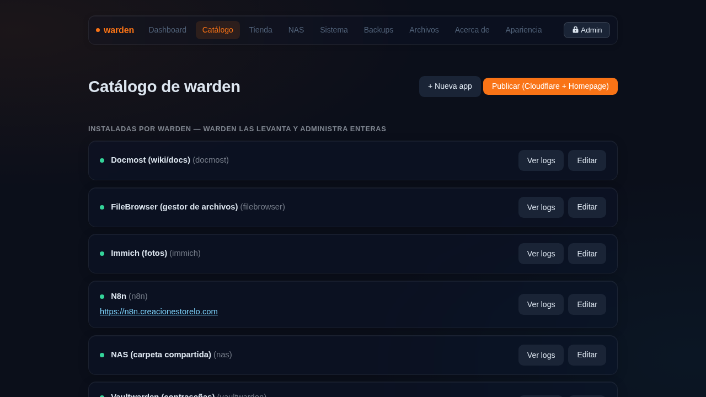

# Catálogo



El catálogo es la **fuente de verdad** de warden. Cada app se define una sola vez y esa definición la consumen el instalador, el backup, la restauración y el CI/CD.

## Lista de apps

Las apps aparecen en dos grupos:

- **Instaladas por warden**: Docker Compose gestionado por warden.
- **Desplegadas vía CI/CD**: el build/deploy lo hace GitHub Actions en tu server.

Cada card muestra el estado real (corriendo/caída), el link si tiene subdominio, y botones de acción.

## Acciones por app

### Ver logs en vivo
El botón **Ver logs** abre un visor de las últimas 100 líneas del contenedor con auto-scroll y refresco cada 2 segundos. El scroll solo baja solo si estás al final — si subiste a leer, no te interrumpe.

### Editar app
Formulario con todos los campos del componente:

- Nombre y tag
- Tipo de backup (files / postgres / none)
- Rutas de datos para respaldar
- Subdominio Cloudflare y puerto
- Selector de puerto: muestra los puertos que expone el contenedor para elegir con un click
- Editor del `docker-compose.yml` integrado — sin terminal

Al guardar con subdominio, publica el túnel automáticamente en background y redirige de inmediato.

### Eliminar app
Baja el contenedor, borra imágenes y volúmenes, regenera el túnel y borra el registro DNS de Cloudflare (si configuraste el API Token).

## Agregar una app nueva

Botón **+ Nueva app** → formulario de alta. Los campos mínimos son nombre y tag; los demás son opcionales según lo que necesite la app.

## Instalar desde el catálogo

Apps que están definidas en el catálogo pero no instaladas tienen un botón **Instalar** que muestra el log en vivo del proceso.

## Definir una app en el catálogo

Creá un archivo `site/catalog/<tag>.component`:

```ini
COMP_NAME="Mi App"
COMP_CONTAINER="miapp"
COMP_PATHS="/srv/warden/miapp"
COMP_BACKUP_TYPE="files"
COMP_CF_HOST="miapp.tudominio.com"
COMP_CF_PORT="8080"
```

| Campo | Descripción |
|---|---|
| `COMP_NAME` | Nombre legible |
| `COMP_CONTAINER` | Nombre del contenedor Docker |
| `COMP_PATHS` | Rutas a respaldar (separadas por espacio) |
| `COMP_BACKUP_TYPE` | `files`, `postgres` o `none` |
| `COMP_CF_HOST` | Subdominio para Cloudflare Tunnel |
| `COMP_CF_PORT` | Puerto del contenedor para el tunnel |
| `COMP_INSTALL` | Ruta al script de instalación (opcional) |
