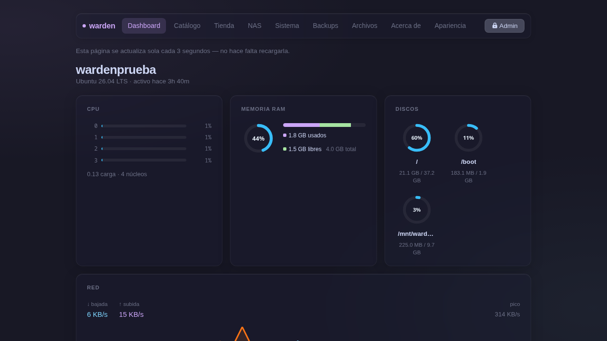
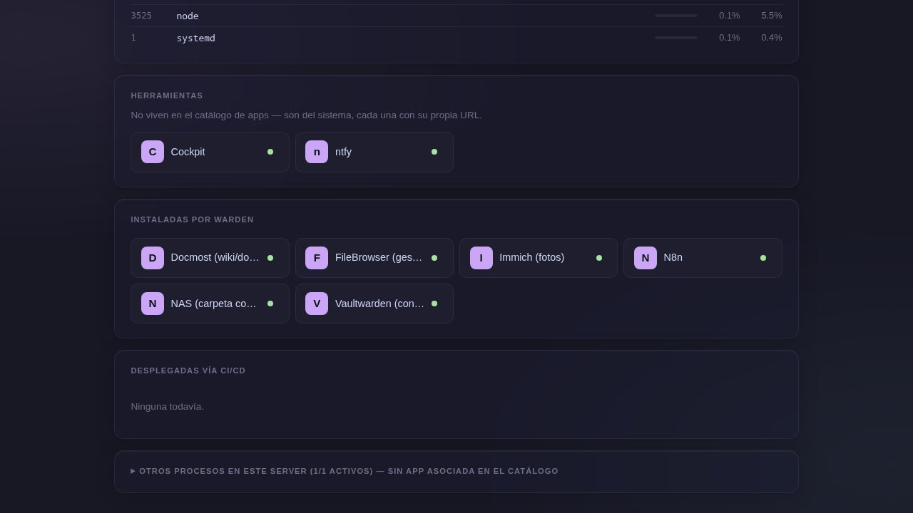

# Dashboard

El dashboard muestra el estado real del servidor y se actualiza solo cada 3 segundos — no hace falta recargar la página.

## Métricas en vivo

### CPU
Barra de carga por núcleo con porcentaje individual y carga promedio del sistema.

### Memoria RAM
Donut SVG con porcentaje de uso, detalle de GB usados/libres/total y barra segmentada.

### Discos
Un donut por partición montada con porcentaje de uso, etiqueta y tamaño.

### Red
Velocidades de bajada y subida en tiempo real, más un **histograma de los últimos ~2 minutos** (sparkline de bajada en azul y subida en naranja).

### Procesos top CPU
Lista de los procesos con mayor consumo: PID, nombre, barra de CPU y porcentaje de memoria.

## Apps

Muestra todas las apps en dos grupos:

- **Instaladas por warden**: apps del catálogo gestionadas directamente.
- **Desplegadas vía CI/CD**: apps que viven en su propio repo y se despliegan con GitHub Actions.

Cada app muestra su estado real (punto verde = corriendo, gris = caída) y un link directo si tiene subdominio configurado.

## Herramientas del sistema

Apps que no viven en el catálogo warden pero están instaladas en el sistema (Cockpit, Backrest, ntfy) aparecen acá con su URL directa.
