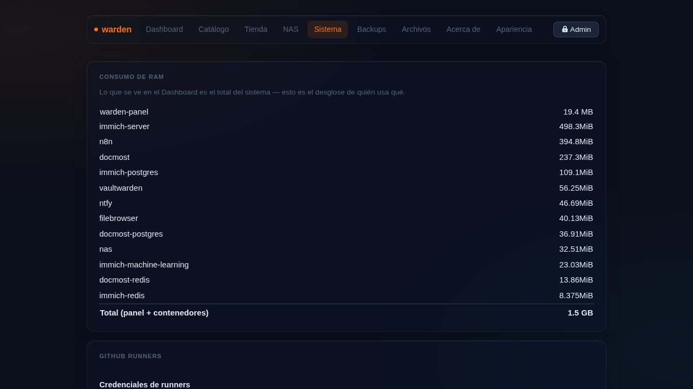

# Sistema



La sección Sistema agrupa todo lo que afecta la infraestructura del server.

## Zona horaria

Selector con zonas de América Latina, Europa y otras regiones. Se aplica en vivo con `timedatectl` — todos los timestamps del panel se actualizan de inmediato.

```bash
# CLI equivalente
sudo timedatectl set-timezone America/Bogota
```

## VPN — Tailscale

Conecta tu server a una red privada virtual mesh. Funciona tras CGNAT sin abrir puertos.

1. **Instalar VPN** — instala Tailscale en el sistema.
2. **Conectar** — el link de autorización aparece en el panel **en tiempo real** (polling cada segundo). Abrilo en el navegador para aprobar el dispositivo.

Una vez conectado, el panel muestra la IP Tailscale del server.

```bash
sudo warden vpn              # instala y conecta
sudo warden vpn exit-node on # este server como salida de internet
sudo warden vpn subnet on 192.168.1.0/24  # anuncia subred
```

## Túnel Cloudflare

Expone tus apps a internet sin abrir puertos del router ni tener IP pública.

1. **Configurar** — muestra la URL de login de Cloudflare en streaming. Abrila para autenticarte.
2. Una vez configurado, el panel muestra el dominio y las apps publicadas.
3. Cada vez que editás o agregás una app con subdominio, warden regenera el ingress automáticamente.

```bash
sudo warden cloudflare-init    # primera vez
sudo warden cloudflare-reset   # borrar y reconfigurar
sudo warden publish            # regenerar ingress manualmente
```

### API Token de Cloudflare

Opcional — guardalo para que al eliminar una app también se borre el registro DNS de Cloudflare automáticamente.

## Alertas push — ntfy

Instala [ntfy](https://ntfy.sh) como servidor self-hosted de notificaciones push.

1. **Instalar ntfy** — log en vivo igual que la tienda.
2. Una vez activo, el panel muestra la URL del servidor ntfy.
3. Suscribite al topic desde la app móvil de ntfy.

Las alertas se envían automáticamente cuando:
- Un backup falla o tiene advertencias
- Un contenedor del catálogo cae (watch cada 5 min vía systemd timer)
- `restic check` detecta problemas

```bash
sudo warden ntfy   # instalar/reinstalar
```

## Runners de GitHub Actions

Lista de self-hosted runners registrados con su estado (online/offline).

Para registrar un runner nuevo: **Catálogo** → editar la app → **Registrar runner** (pegás el token de GitHub, sin terminal).

```bash
sudo warden runner https://github.com/USUARIO/REPO <TOKEN>
```

## Secretos (`age`)

- **Generar llave age** — crea la llave de cifrado para escrow de secretos.
- **Respaldar secretos** — cifra y guarda en `site/secrets/` las credenciales del túnel.

```bash
sudo warden secrets init      # generar llave
sudo warden secrets save      # respaldar secretos
sudo warden secrets restore   # restaurar secretos
```

## Consumo de RAM

Desglose de memoria: cuánto usa el panel propio vs cada contenedor Docker.

## Zona de peligro

!!! danger "Irreversible"
    El botón **Eliminar sistema** borra **TODO** lo que warden instaló: contenedores, datos, `/etc/warden`, túnel de Cloudflare en tu cuenta, Tailscale, reglas de firewall y paquetes instalados.
    
    Pedirá escribir `BORRAR` literal para habilitar el botón. El log corre en vivo — el panel se apaga al final, eso es normal.

```bash
sudo warden reset   # equivalente en CLI
```
