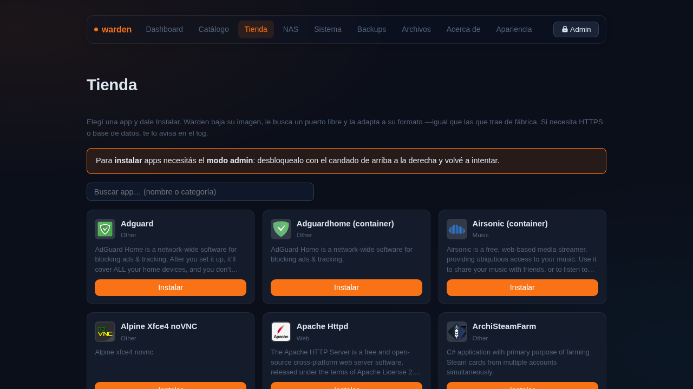

# Tienda



La Tienda muestra más de 100 apps self-hosted listas para instalar, tomadas de las [plantillas de la comunidad de Portainer](https://github.com/portainer/portainer/blob/develop/api/stacks/templates.json).

## Instalar una app

1. Buscá la app por nombre o categoría.
2. Hacé click en **Instalar**.
3. El log de instalación aparece fijo en pantalla — podés seguir navegando.

warden detecta si la app tiene una **receta curada** (en `stacks/`) y la usa directamente. Si no, importa el Compose de Portainer y lo adapta al formato warden automáticamente.

Las apps ya instaladas aparecen marcadas visualmente y no se pueden instalar dos veces.

## Apps con receta curada

Estas apps tienen `docker-compose.yml` y configuración optimizada en `stacks/`:

| App | Stack incluido |
|---|---|
| Vaultwarden | Gestor de contraseñas compatible con Bitwarden |
| Immich | Galería de fotos self-hosted |
| Docmost | Wiki colaborativa |
| Excalidraw | Pizarra colaborativa |
| ntfy | Servidor de alertas push |

## Instalar desde un Compose propio

Al final de la tienda hay un campo para pegar un `docker-compose.yml` propio o una URL que lo contenga. warden lo importa, extrae el nombre del contenedor, los volúmenes y los puertos, y lo registra en el catálogo.

```bash
# Equivalente en CLI
warden import /ruta/al/docker-compose.yml miapp
```

!!! warning "Modo admin requerido"
    Para instalar apps necesitás desbloquear el modo admin con el candado de arriba a la derecha.
